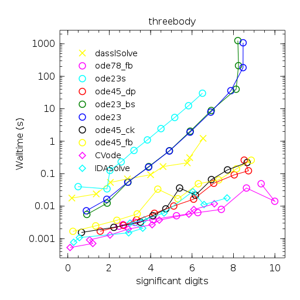
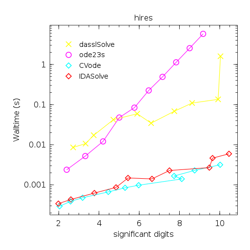
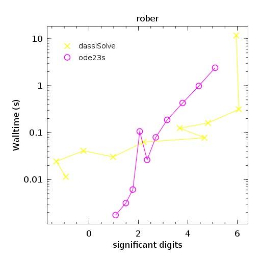
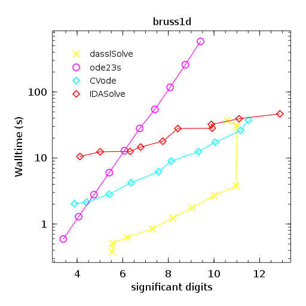
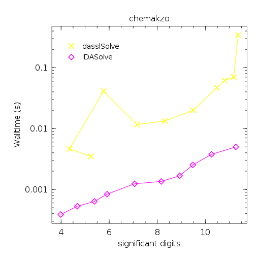
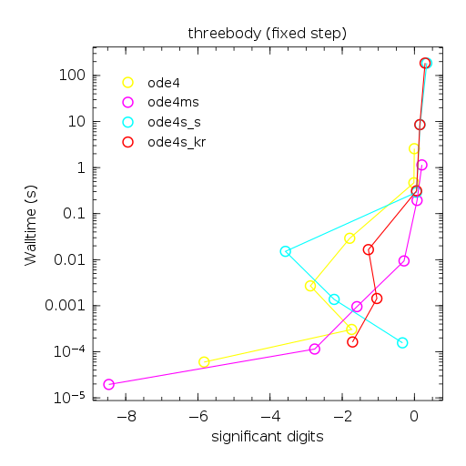
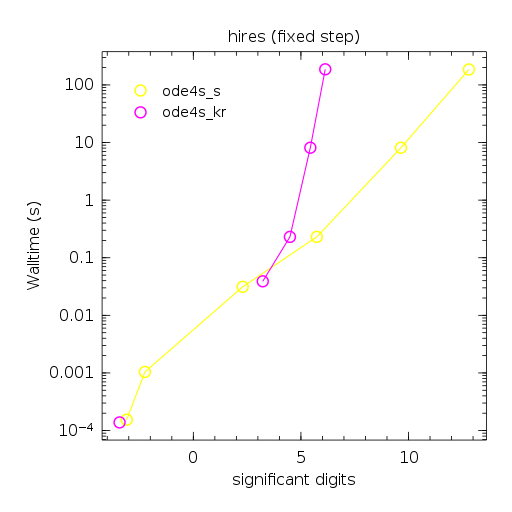
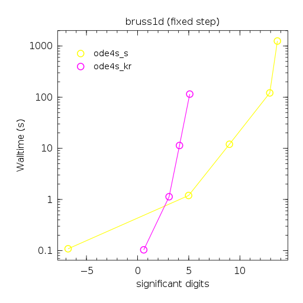

# Results

These results show some of the solvers in plots of significant digits
vs wall-time, similar to the plots of the
[Bari-IVP testset](http://www.dm.uniba.it/~testset/testsetivpsolvers/).
These tests can be run with the scrips
[runsuites.jl](testsuites/runsuites.jl) which will store the plots in
`testsuites/output`.  Below tests were run on a Intel i7-3520M CPU @
2.90GHz.

A few observations:

- DASSL.jl seems to be as capable as the Sundials solvers if sometimes
  slower but also sometimes faster.
- For large(-ish) systems, e.g. stemming from PDEs, DASSL.jl seems to
  be the best and fastest choice at the moment because of the patchy support of
  sparse Jacobians in Sundials. (please correct me if wrong).
- ODE.ode23s does ok too but is generally a lot slower than DASSL,
  presumably because of its lower order.

However, note that I haven't really optimised the code extensively, so
the timings might be off.

## Non-stiff

- explicit ODE.ode78_fb is best
- the two (implicit) Sundials are very fast too

## Stiff

- The Sundials solvers did not manage to cope with this problem at
  all, thus no results are shown.  Still need to investigate this further.

- DASSL beats the Sundials solvers with this fairly large system.
  Maybe because it can use the analytic Jacobian, which is sparse.
- DASSL is about a 1000x faster than ode23s at 9 significant digits.

## DAE

## Fixed step solvers of ODE.jl

They do not work for all the test cases, here the ones where they can
work.  Step size was uniform and number of steps was
[10,10^2,10^3,10^4,10^5,5*10^5].

### Non-stiff

- Need more than 100,000 steps to get into the broad vicinity of the
  solution.

### Stiff

- fixed step solvers do a reasonable job here. ode4s_s is about as
  fast as adaptive ode23s.

- ode4s_s is about 100x faster than ode23s for 9 significant digits,
  but 10x slower than dassl.

Test-case rober does not work at all with fixed step solvers.

### DAE

None are applicable.
